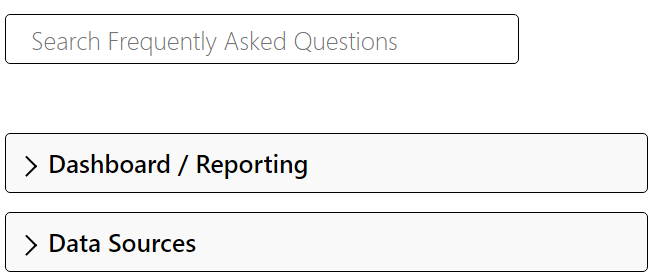
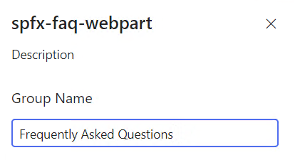

# spfx-faq-webpart

## Summary

SharePoint FAQ WebPart modified from https://pnp.github.io/sp-dev-fx-webparts/samples/type/

#

## Minimal Path to Build

- Clone this repository
- Ensure that you are at the solution folder
- in the command-line run:
  - **npm install**
  - **gulp serve**

## Prerequisites

### SharePoint list setup

This webpart is dependent on the SharePoint list template.  To install template, please do the following:

1) Install <a href="https://pnp.github.io/powershell/" target="_blank">PnP PowerShell</a>
2) Run the script

`
$Url = "INSERT PATH TO SHAREPOINT LIST"
Connect-PnPOnline -Url $Url -Interactive

Invoke-PnPSiteTemplate -Path .\list_template\FAQTemplate.xml
`

3) Insert data into the SharePoint list.

### Configuration

To point the webpart to the SharePoint list, please selected "Edit Web Part" and then enter the name of the SharePoint list under "Group Name" (see Figure 1)

#
*Figure 1 - Edit Web Part panel*

### Package Solution

gulp package-solution --production

## References

- [Getting started with SharePoint Framework](https://docs.microsoft.com/en-us/sharepoint/dev/spfx/set-up-your-developer-tenant)
- [Building for Microsoft teams](https://docs.microsoft.com/en-us/sharepoint/dev/spfx/build-for-teams-overview)
- [Use Microsoft Graph in your solution](https://docs.microsoft.com/en-us/sharepoint/dev/spfx/web-parts/get-started/using-microsoft-graph-apis)
- [Publish SharePoint Framework applications to the Marketplace](https://docs.microsoft.com/en-us/sharepoint/dev/spfx/publish-to-marketplace-overview)
- [Microsoft 365 Patterns and Practices](https://aka.ms/m365pnp) - Guidance, tooling, samples and open-source controls for your Microsoft 365 development

## Disclaimer

**THIS CODE IS PROVIDED _AS IS_ WITHOUT WARRANTY OF ANY KIND, EITHER EXPRESS OR IMPLIED, INCLUDING ANY IMPLIED WARRANTIES OF FITNESS FOR A PARTICULAR PURPOSE, MERCHANTABILITY, OR NON-INFRINGEMENT.**

---